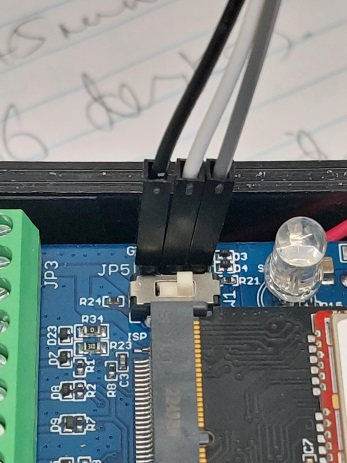
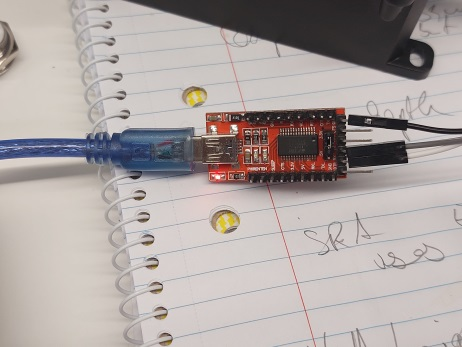

# Firmware

## Development setup

Steps to set up for development.

1.  Install VS Code
1.  Install [GitHub Desktop](https://desktop.github.com/)
1.  Install [Git](https://git-scm.com/downloads)  
https://github.com/git-for-windows/git/releases/download/v2.42.0.windows.2/Git-2.42.0.2-64-bit.exe

Following: http://wiki.dragino.com/xwiki/bin/view/Main/User%20Manual%20for%20LoRaWAN%20End%20Nodes/LA66%20LoRaWAN%20Module/Compile%20and%20Upload%20Code%20to%20ASR6601%20Platform/ 


1.  Install [MSYS2](https://www.msys2.org/) - `msys2-x86_64-20231026.exe`
1.  Open MSYS2
1.  `pacman -S git vim make unzip python python-pip`
1.  `pip install pyserial configparser`
1.  [LA66 repo]()  
    ```
    cd \repos\dragino
    git clone https://github.com/dragino/SN50v3.git
    ```  
1.  [GNU ARM Embedded Toolchain](https://developer.arm.com/downloads/-/gnu-rm)  
https://developer.arm.com/-/media/Files/downloads/gnu-rm/9-2020q2/gcc-arm-none-eabi-9-2020-q2-update-win32.zip?revision=95631fd0-0c29-41f4-8d0c-3702650bdd74&rev=95631fd00c2941f48d0c3702650bdd74&hash=6F4A81645729182A4B6E8C52524B36ACD1350722  
Zip file copied to C:\repos\LA66\tools\toolchain

1.  Update `Projects\Applications\DRAGINO-LRWAN-AT\Makefile` line 35, change region: `-DREGION_AU915`
1.  In MSYS32, `cd /c/repos/LA66`
1.  `source build/envsetup.sh`
1.  `cd Projects/Applications/DRAGINO-LRWAN-AT`
1.  `make`

Source code is now built and ready to install.

## Firmware update via UART

1.  Open SN50v3.
1.  Connect 3 female-female wires to UART:  
 
1.  Connect wires to USB-adapter, crossing TX & RX, e.g. (using [FTD1232](https://learn.sparkfun.com/tutorials/ftdi-smartbasic-hookup-guide/all)):  
 
1.  Start up Putty session on relevant port at 9600 baud.
1.  Close down SN50v3 (press push-button quickly 5 times).
1.  Boot SN50v3 (press button for 4 seconds).
1.  Alternative to above 2 steps - just press the Reset button at top-left of PCB.
1.  We should now see the bootloader message in Putty.
    ```
    Dragino OTA bootloader AU915 v1.3
    AT+NAMEA840413311886F9F

    Use Sensor is STH3x

    Dragino SN50_v3-LB Device
    Image Version: v1.1
    LoRaWan Stack: DR-LWS-007
    Frequency Band: AU915
    DevEui= A8 40 41 33 11 88 6F 9F
    Enter Password to Active AT Commands
    ```
1.  Refer to [UART Access for LoRa ST v4 base model](http://wiki.dragino.com/xwiki/bin/view/Main/UART%20Access%20for%20LoRa%20ST%20v4%20base%20model/) section 3.2.1 (Update a firmware via Dragino Sensor Manager Utility.exe).

## Firmware update OTA

1.  Download LA66 Driver from Silicon Labs: [CP210x Universal Windows Driver](https://www.silabs.com/documents/public/software/CP210x_Universal_Windows_Driver.zip) and expand zip file.
1.  Start Device Manager as Administrator and Update driver, searching in expanded zip file's folder.
